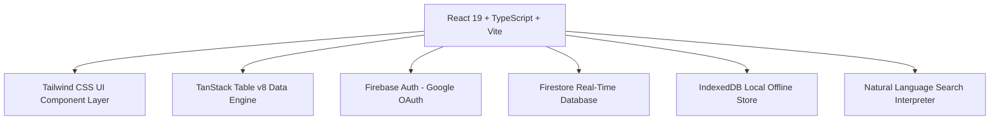

# Basechan Commission Management System (Basechan CMS)

> **University Commission Intelligence, Multi-Aggregator Rate Comparator, & Partner Payout Directory**

[](https://basechan-cms.web.app)
[](https://react.dev)
[](https://www.typescriptlang.org/)
[](https://firebase.google.com)
[](#)

---

## Executive Summary

**Basechan Commission Management System (Basechan CMS)** is a centralized, real-time intelligence web application built for international education agencies, university recruitment staff, counselors, and education partner sub-agents. 

The platform replaces fragmented, static Excel workbooks with a single searchable directory that compares incoming university master commission agreements against outgoing sub-agent payouts. It automates profit margin calculations ($\text{DIFF} = \text{Master Rate} - \text{Agent Rate}$), provides multi-portal application routing guidance, offers interactive deal revenue estimators, and features an AI-assisted natural language search engine with full offline capability.

---

## Why Basechan CMS Was Built

International student recruitment agencies manage hundreds of university partnership contracts across direct agreements and third-party aggregator portals (such as SI-UK, EDVOY, UAP, and CRIZAC). Managing these agreements in static spreadsheets introduces significant operational bottlenecks:

1. **Margin Discrepancies & Profit Leakage**: Calculating net retained margins across percentage rates (%) and flat-fee payouts (£/$) across multiple intakes leads to pricing errors.
2. **Misrouted Applications**: Counselors frequently submit student applications through lower-yielding portals without realizing a higher-commission route exists for the same university.
3. **Information Asymmetry**: Sub-agents need visibility into guaranteed commission rates without exposing sensitive incoming master agreement contracts or internal profit margins.
4. **Lack of Auditability**: Spreadsheet updates lack version control, making it difficult to track who modified a rate, when, or why.

**Basechan CMS** solves these problems by providing a secure, role-based platform that unifies contract data, optimizes application routing, and safeguards proprietary financial terms.

---

## Key Features & Capabilities

### 1. Multi-Role Access Control & Specialized Portals

The platform enforces strict role-based data partitioning across three distinct user tiers:

| Feature / Capability | Admin Portal | Staff Portal | Agent Portal |
| :--- | :---: | :---: | :---: |
| **View Master Rates & Internal Margins** | ✅ | ❌ | ❌ |
| **View Agent Guaranteed Payout Rates** | ✅ | ❌ | ✅ |
| **Application Portal Routing Guide** | ✅ | ✅ | ❌ |
| **Excel Workbook Batch Ingestion** | ✅ | ❌ | ❌ |
| **Rate Editing, Creation, & Deletion** | ✅ | ❌ | ❌ |
| **User Role & Access Management** | ✅ | ❌ | ❌ |
| **Currency Switcher (GBP, USD, EUR, NGN)** | ✅ | ✅ | ✅ |
| **Watchlist & Starred Institutions** | ✅ | ✅ | ✅ |
| **Shareable Quote Cards** | ✅ | ✅ | ✅ |

- **Admin Portal**: Complete financial oversight with master rates, agent payouts, net margin calculations, batch Excel ingestion, user management, and audit logging.
- **Staff Portal**: Application submission guide for counselors, detailing which aggregator portal (EDVOY, SI-UK, UAP, CRIZAC) to use for each school, intake, and study level, accompanied by school priority status (`Focus / Green`, `Allowed`, `Do Not Use`).
- **Agent Partner Portal**: Clean, white-labeled commission schedule displaying guaranteed sub-agent payout rates and currency conversion tools without exposing master agreements or internal company margins.

---

### 2. Interactive Deal & Revenue Estimator

The **Student Deal & Profit Calculator** enables counselors to model recruitment revenue in real time:

- **Input Parameters**: Select a university route, enter tuition fee per student (£), and specify student enrollment count.
- **Instant Calculations**:
  - $\text{Total Tuition} = \text{Tuition Fee} \times \text{Student Count}$
  - $\text{Master Income} = \text{Total Tuition} \times \text{Master Rate \%}$
  - $\text{Agent Payout} = \text{Total Tuition} \times \text{Agent Rate \%}$
  - $\text{Net Retained Profit} = \text{Master Income} - \text{Agent Payout}$
- **Route Yield Optimizer**: Automatically detects and alerts counselors if another aggregator portal offers a higher profit margin for the selected institution.

---

### 3. Visual Yield Analytics & Performance Charts

Integrated data visualization cards provide high-level executive insights:

- **Platform Yield Comparison**: Bar chart comparing average profit margins across aggregators (SI-UK, EDVOY, UAP, CRIZAC, BASECHAN).
- **Margin Tier Distribution**: Visual breakdown categorizing routes into margin brackets (`15%+ High Yield`, `10–15% Good Margin`, `5–10% Standard`, `0–5% Low Margin`, `Flat Fee / Net`).
- **Top 10 High-Yield Leaderboard**: Ranked list of the highest-yielding university routes in the database.

---

### 4. Smart Predictive Entry & Bulk Intake Migration

- **Predictive Dropdown Autocomplete**: All text fields (`University Name`, `Country`, `Intake`, `Aggregator`, `Source Sheet`) feature combobox autocomplete with predictive matching and 1-click `"Add as new"` capability.
- **Auto-Predict Country**: Selecting a university automatically predicts and populates its country based on existing contract records.
- **Single-Rate Template Copying**: Select any existing route template to pre-fill past rate details, requiring only an updated intake term to save.
- **Bulk Intake Sheet Migration**: 1-click cloning of entire intake sheets (e.g. migrating 300+ rates from `Sept 2026` to `Jan 2027`) with optional bulk rate percentage adjustments (+X%).

---

### 5. Natural Language Chat Assistant & Offline Engine

- **AI-Powered Natural Language Queries**: Type conversational questions like *"Show me postgraduate focus schools in the UK with over 10% agent payout"* or *"Compare Aberdeen and Abertay for Jan 2027"*.
- **Offline Local-First Storage**: IndexedDB database caching enables instant offline searching, filtering, and route viewing when internet connectivity drops.
- **Real-Time Offline Banner**: Automatic network detection banner notifying users of offline operation and auto-syncing changes upon reconnect.

---

### 6. Exporting, Printing, & Audit Compliance

- **Data Exports**: Export filtered rate schedules to Excel (`.xlsx`) or download custom CSV files.
- **Printable Schedules**: Generate clean, printable PDF routing schedules formatted for physical distribution.
- **Revision Audit Log**: Real-time Firestore audit drawer tracking who modified a rate, timestamp, and field deltas (`old value → new value`).
- **Data Governance**: Integrated Corporate Terms Gateway, Privacy Policy, Data Processing Addendum (DPA), and Cookie Management.

---

## Technical Stack & Architecture



- **Frontend Framework**: React 19, TypeScript, Vite
- **Styling**: Tailwind CSS v4 (Light & Dark Mode)
- **Table Engine**: TanStack Table v8
- **Icons**: Lucide React
- **Backend & Database**: Firebase Firestore (Real-time listeners, batch writes)
- **Authentication**: Firebase Auth (Google OAuth)
- **Offline Database**: IndexedDB with LocalStorage fallback
- **Testing Suite**: Vitest (166+ unit tests across 23 test modules)

---

## Getting Started & Local Development

### Prerequisites

- **Node.js**: v18.0.0 or higher
- **npm**: v9.0.0 or higher

### Installation

1. **Clone the Repository**:
   ```bash
   git clone https://github.com/johnnym5/Basechan-Commission-management-system.git
   cd Basechan-Commission-management-system
   ```

2. **Install Dependencies**:
   ```bash
   npm install
   ```

3. **Start the Development Server**:
   ```bash
   npm run dev
   ```
   Open [http://localhost:5173](http://localhost:5173) in your browser.

4. **Run Unit Tests**:
   ```bash
   npm test -- --run
   ```

5. **Build for Production**:
   ```bash
   npm run build
   ```

---

## Security & Compliance Statement

- **Credential Protection**: No private API keys, service accounts, or database passwords are embedded in source repositories.
- **Formula Injection Defense**: All imported Excel cells are sanitized to strip leading formula execution characters (`=`, `+`, `-`, `@`).
- **Data Privacy**: Student and sub-agent commission terms are encrypted in transit (TLS 1.3) and at rest under GDPR guidelines.

---

## Live Deployment

- **Hosting Platform**: Firebase Hosting
- **Production URL**: [https://basechan-cms.web.app](https://basechan-cms.web.app)
- **Project Console**: [Firebase Overview](https://console.firebase.google.com/project/basechan-cms/overview)

---

*Basechan Commission Management System © 2026 Basechan International. All rights reserved.*
